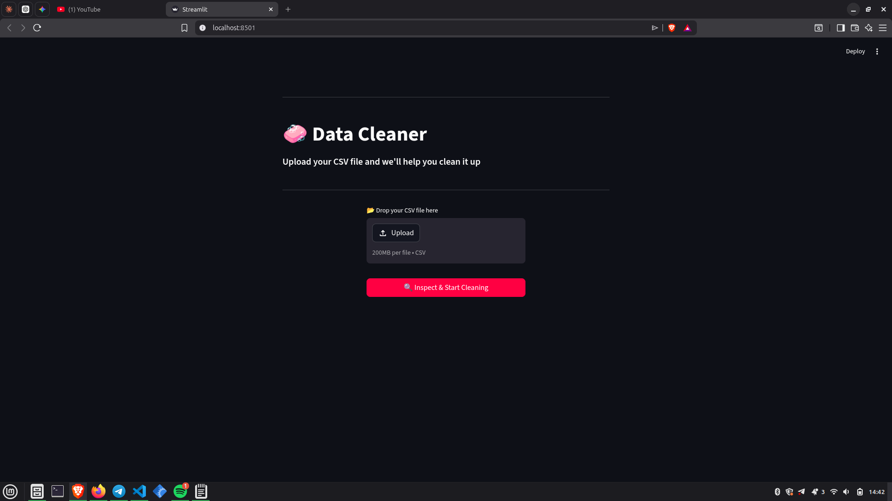
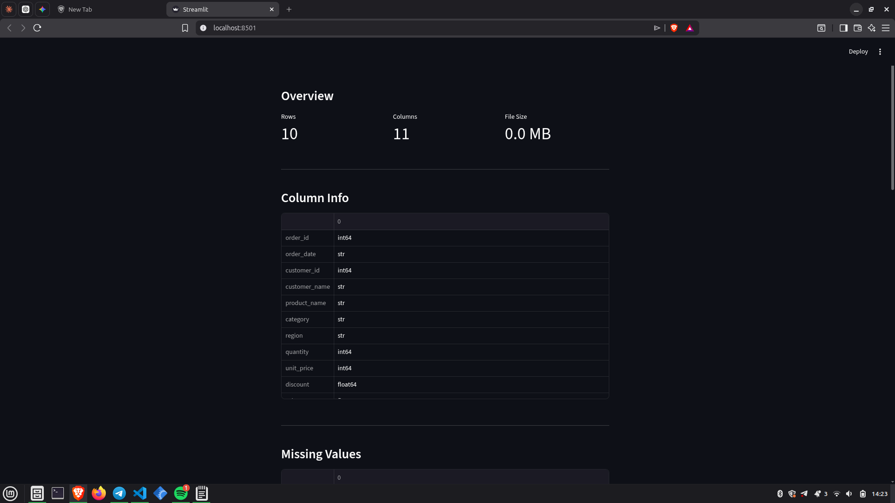
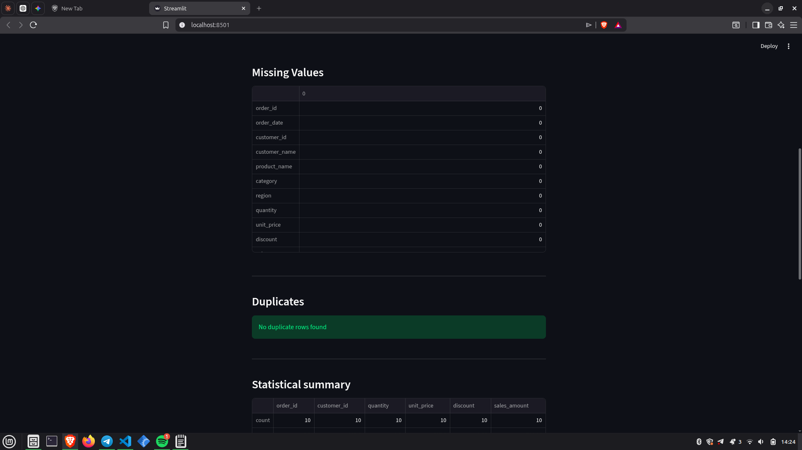
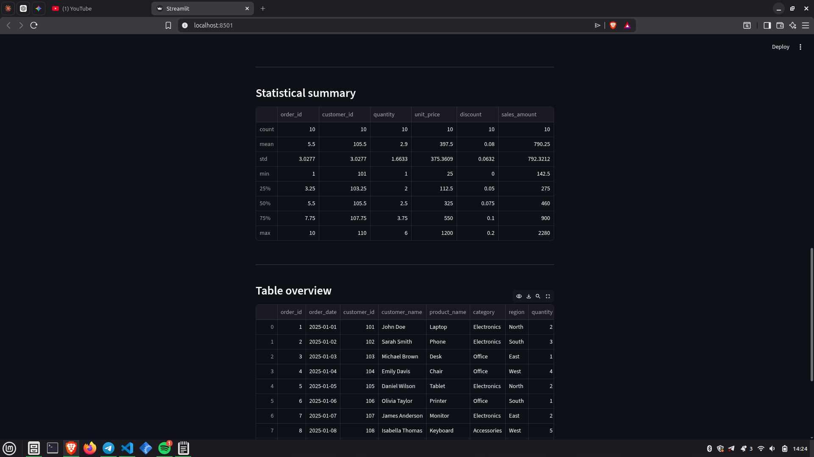
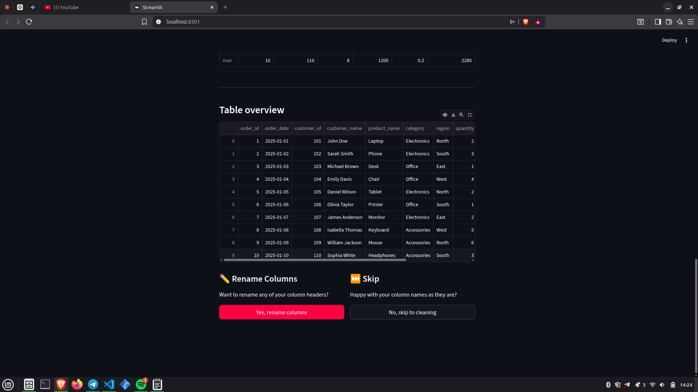
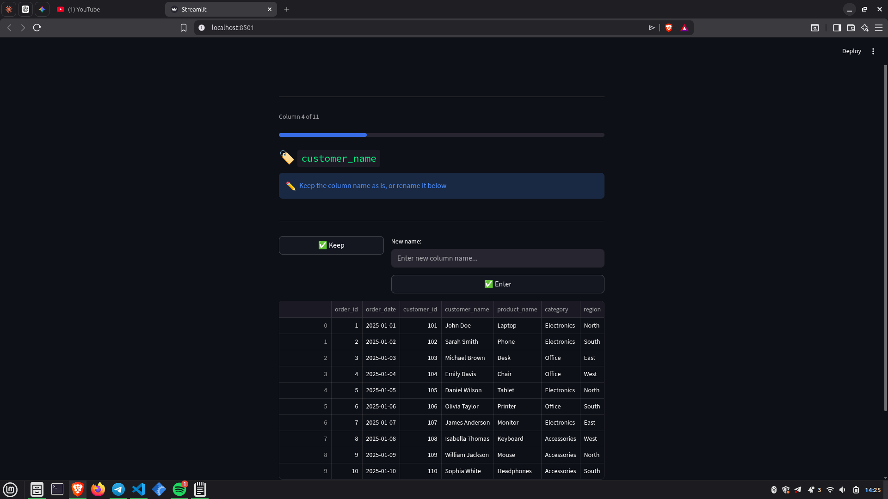
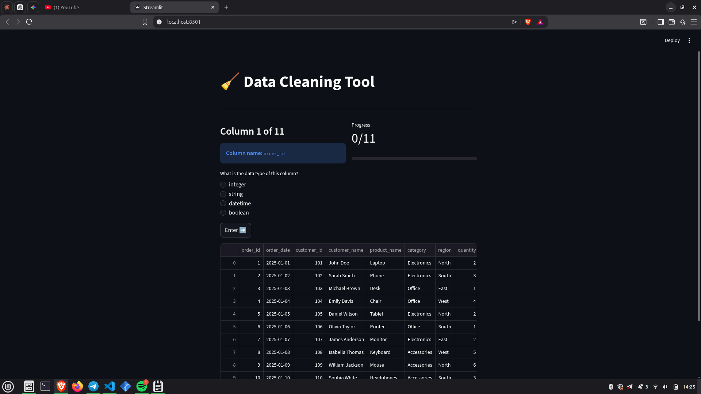
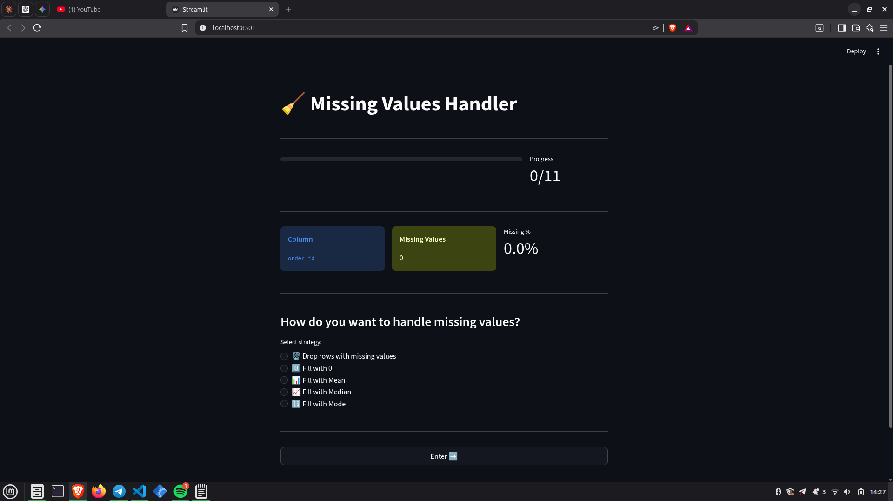
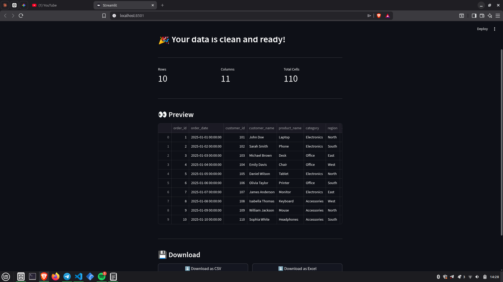

# Reusable Data Cleaning Project

A no-code, step-by-step CSV data cleaning tool built with Streamlit and Pandas. Upload your CSV, clean it column by column, and download the result — no Python knowledge required.

---

##  Features

- **Upload & Inspect** — view shape, data types, missing values, duplicates, and statistical summary before touching anything
- **Rename Columns** — rename any column header or keep it as is
- **Fix Data Types** — cast columns to integer, string, datetime, or boolean
- **Handle Missing Values** — drop rows or fill with zero, mean, median, or mode per column
- **Clean Text** — strip whitespace, remove all spaces, or standardize casing (uppercase, lowercase, capitalize)
- **Download** — export your cleaned data as CSV or Excel (.xlsx)

---

##  App Flow

| Step | Page |
|------|------|
| 1 | Upload CSV |
| 2 | Inspect Data |
| 3 | Rename Columns _(optional)_ |
| 4 | Fix Data Types |
| 5 | Handle Missing Values |
| 6 | Clean Text Data |
| 7 | Download Cleaned File |

### Upload CSV


### Inspect Data





### Rename Columns


### Fix Data Types


### Handle Missing Values


### Download Cleaned File


---

## 🛠️ Tech Stack

- [Streamlit](https://streamlit.io/) — UI framework
- [Pandas](https://pandas.pydata.org/) — data manipulation
- [NumPy](https://numpy.org/) — missing value replacement
- [OpenPyXL](https://openpyxl.readthedocs.io/) — Excel export

---

## ⚙️ Installation

```bash
# Clone the repo
git clone https://github.com/biniyamsav/streamlit-data-cleaner.git
cd streamlit-data-cleaner

# Create and activate virtual environment
python -m venv venv
source venv/bin/activate  # On Windows: venv\Scripts\activate

# Install dependencies
pip install -r requirements.txt

# Run the app
streamlit run app.py
```

---

##  Project Structure

```text
streamlit-data-cleaner/
├── app.py              # Main application — all pages and logic
├── assets/              # Screenshots used in this README
└── README.md
```

---

## 🙌 Author

Built by **Biniyam** — feel free to fork, use, or contribute.
